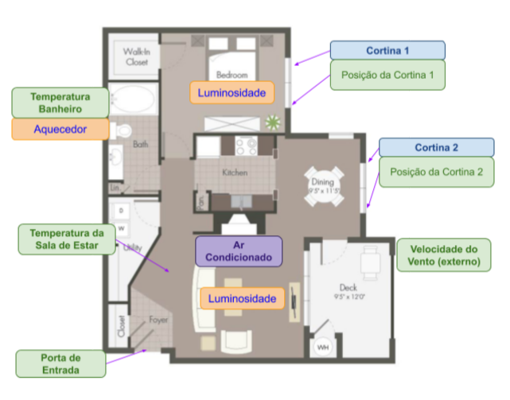
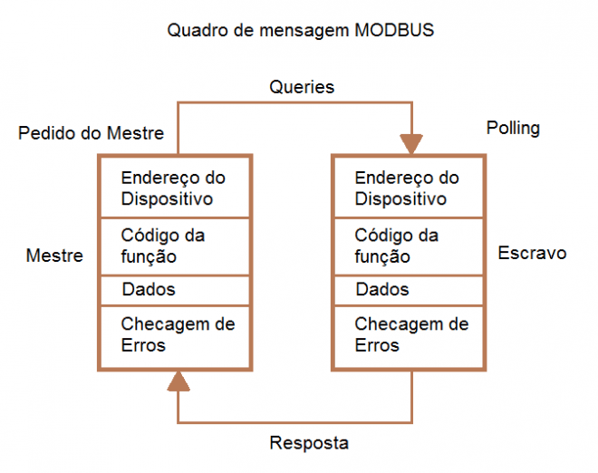
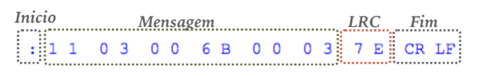
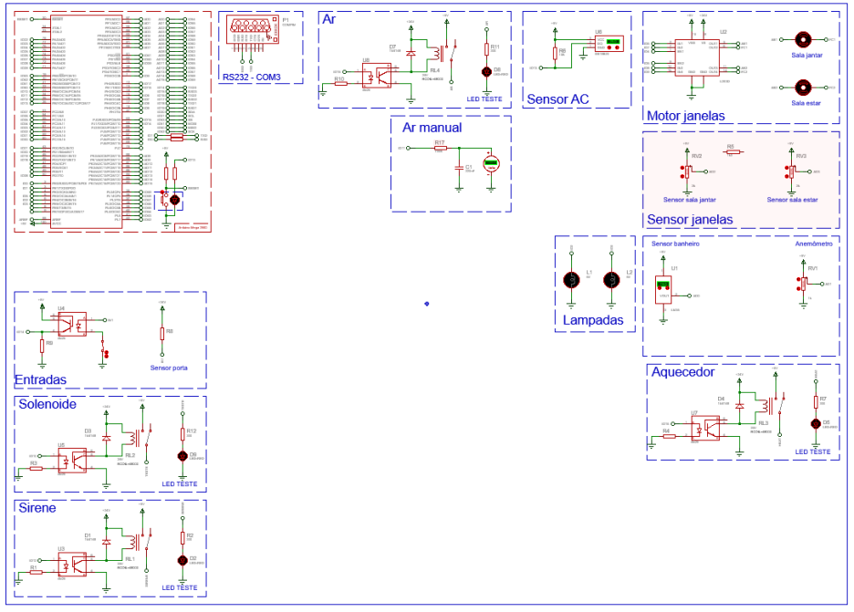
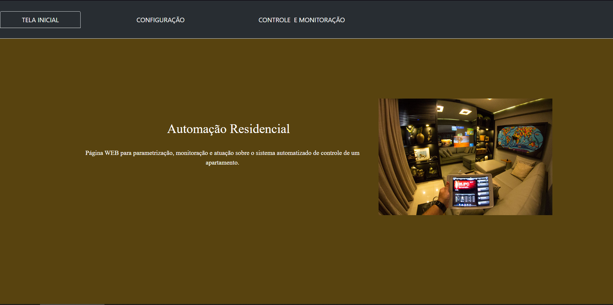
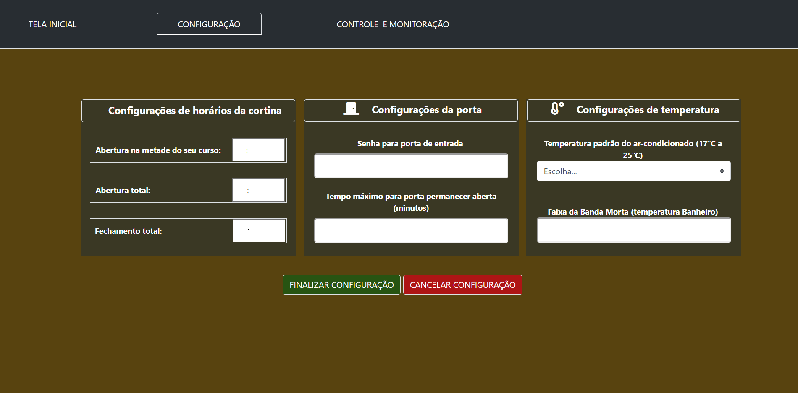
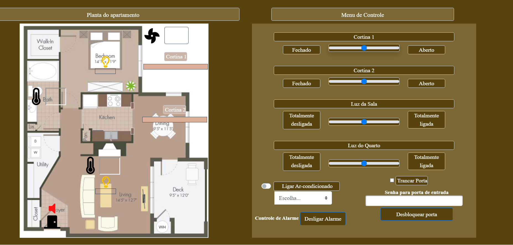

# Automação e Monitoramento Residencial
## Trabalho final de Automação 2 / ECP-UPF

* <b>Descrição geral</b>:

 

   

   O sistema tem como objetivo uma pequena automação residencial. O sistema deve controlar alguns elementos dentro de um apartamento, como as cortinas, temperatura do ar condicionado, a tranca da porta, dimmer das luzes, etc. Também deve monitorar algumas variáveis, como a própria temperatura, a velocidade do vento do lado de fora, entre outros. O sistema é controlado através de um Arduino e um firmware escrito em C++. As variáveis de controle são alteradas e monitoradas via uma interface web desenvolvida usando HTML, CSS, Js e o framework Bootstrap. As informações são transmitidas ao controlador via um servidor web JavaScript. 

* <b>Comunicação</b>

  O projeto utiliza o protocolo de comunicação mestre-escravo Modbus em modo ASCII via RS-232 (Recommendad Standart-232), o que só permite dois dispositivos na rede, comumente conhecido como conexão ponto-a-ponto, sendo o Modbus o mestre, e o Arduino o escravo.
  
 

   

  Utilizando o Modbus ASCII, cada unidade de 8 bits transmite como dois caracteres ASCII. O ASCII pode ter até um segundo entre os caracteres sem criar um erro na comunicação. Quando uma mensagem é enviada entre um mestre e o escravo, o código de função (function code) é o responsável em dizer para o escravo que tipo de ação ele deve fazer. No Modbus ASCII, o function code será 2 caracteres na messagem enviada.
 
 

    

 

 
 * <b>Esquemático</b>
 
 

    

 

 
 * <b>Páginas Web</b>
 
 O sistema web contém 3 páginas para o controle e monitoramento do sistema.
 
  1. <b>Tela Inicial</b>
 

    

 

 
 A tela de home é apenas um *welcome* ao usuário do sistema.
 
  2. <b>Tela de Configuração</b>
 

    

 

 
 A página de configuração permite ao usuário definir as variáveis do sistema.
 
 * <b>Configurações de horários da cortina:</b>
 
 Essa seção permite configurar um horário para que as cortinas se abram ou fechem automáticamente.
  - Abertura na metade do curso
  - Abertura total
  - Fechamento total
  
 ---------///----------
 * <b>Configurações da porta:</b>
 
 Nessa seção se configura a senha da porta de entrada, assim como o tempo que ela pode permanecer aberta antes de disparar um alarme.
  - Senha para porta de entrada
  - Tempo que a porta pode permanecer aberta
  
  ---------///----------
  * <b>Configurações de temperatura</b>
  
  Nessa seção é configurado a temperatura padrão do ar condicionado ao ser ligado, uma temperatura entre 17ºC e 25ºC. Também é possível configurar a banda morta para ligar o aquecedor do banheiro. A banda morta nada mais é do que a diferença de temperatura necessária para desligar o aquecedor do banheiro, sendo a temperatura padrão dele de 17ºC.
  - Temperatura padrão do ar-condicionado
  - Faixa da banda morta
  
  3. <b>Tela de Monitoramento e Ações</b>
  
  

    

 

 
 Nessa tela, o usuário poderá configurar as variáveis do sistema de modo manual, assim como monitorar os valores de todos os elementos da casa.
 
